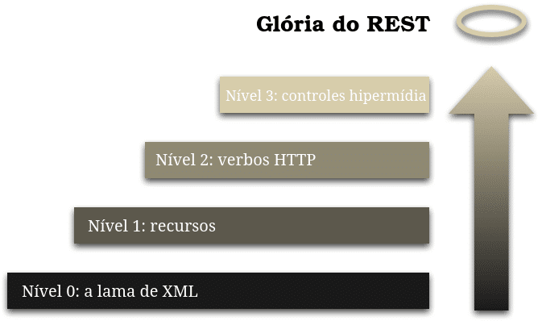

# SpringBoot REST API 

A API REST é como um guia de boas práticas e *RESTful* é a capacidade de determinado sistema de aplicar os princípios de REST

---
## Princípios:

* **cliente-servidor:** aprimorar a portabilidade entra várias plataformas de interface do usuário e servidor, permitindo uma evolução independente do sistema;

* **interface uniforme:** interação uniforme entre cliente e servidor. Para isso é preciso ter uma interface que identifique e represente recursos, mensagens autodescritivas, bem como hypermedia (HATEOAS);

* **stateless:** indica que interação via API tem acesso a dados completos e compreensíveis;

* **cache:** necessário para reduzir o tempo médio de resposta, melhorar a eficiência, desempenho e escalabilidade da comunicação;

* **camadas:** permite que a arquitetura seja menos complexa e altamente flexívevl.

---
## Nível de maturidade



Aqui estão tabelas exemplificando os diferentes níveis de maturidade de uma API REST, conforme o Modelo de Maturidade de Richardson, que vai do nível 0 ao nível 3. 

### Nível 0: Serviços Remotos Baseados em URI (Swamp of POX)
| Aspecto          | Descrição                                                                 |
|------------------|---------------------------------------------------------------------------|
| URI              | Única para todas as operações                                             |
| Operações        | Geralmente uma única operação (ex: POST)                                  |
| Verbo HTTP       | Normalmente sempre o mesmo (POST)                                         |
| Corpo da Mensagem| Contém toda a informação sobre a operação (ex: XML, JSON)                 |
| Exemplo URI      | `/service`                                                                |
| Explicação       | Nesse nível, a API utiliza uma URI única, e a distinção entre operações é feita pelo conteúdo da mensagem, geralmente sem seguir padrões REST. |


### Nível 1: Recursos Individuais (Resource-Based URIs)
| Aspecto          | Descrição                                                                 |
|------------------|---------------------------------------------------------------------------|
| URI              | Distintas para cada recurso                                               |
| Operações        | Diferentes URIs para diferentes tipos de recursos                         |
| Verbo HTTP       | Normalmente sempre o mesmo (POST)                                         |
| Corpo da Mensagem| Contém dados específicos para o recurso, mas com pouca padronização       |
| Exemplo URI      | `/clientes`, `/produtos`                                                  |
| Explicação       | Neste nível, os recursos são separados em URIs distintas, mas ainda é comum ver apenas um verbo HTTP usado para todas as operações. |

### Nível 2: Operações HTTP (HTTP Verbs)
| Aspecto          | Descrição                                                                 |
|------------------|---------------------------------------------------------------------------|
| URI              | Distintas para cada recurso                                               |
| Operações        | Diferentes URIs para diferentes recursos                                  |
| Verbo HTTP       | Uso correto dos verbos HTTP (GET, POST, PUT, DELETE)                      |
| Corpo da Mensagem| Utilizado conforme o verbo HTTP (ex: GET sem corpo, POST com corpo JSON)  |
| Exemplo URI      | `/clientes`, `/clientes/{id}`, `/produtos`                                |
| Explicação       | Neste nível, a API faz uso completo dos verbos HTTP para operar em recursos, conforme as boas práticas REST. |


### Nível 3: HATEOAS (Hypermedia as the Engine of Application State)
| Aspecto          | Descrição                                                                 |
|------------------|---------------------------------------------------------------------------|
| URI              | Distintas para cada recurso                                               |
| Operações        | Uso completo de verbos HTTP                                               |
| Verbo HTTP       | Uso correto dos verbos HTTP                                               |
| Corpo da Mensagem| Inclui hiperlinks para outras operações e recursos relacionados           |
| Exemplo URI      | `/clientes`, `/clientes/{id}`, `/produtos`, com hiperlinks no corpo       |
| Explicação       | Este nível adiciona hipermídia (links) no corpo das respostas, permitindo a navegação dinâmica pela API, conforme o cliente interage com ela. |

---

### Starter do spring-stater-web:
```xml
<dependency>
    <groupId>org.springframework.boot</groupId>
    <artifactId>spring-boot-starter-web</artifactId>
</dependency>
```

## Controller:

É um recurso que disponibiliza as funcionalidades de negócio da aplicação através do protocolo HTTP.

* **@RestController:** Responsável por designar o bean de component que suporta requisições HTTP na arquitetura REST;
* **@RequestMapping("prefix):** Determina qual a URI comum para todos os recursos disponibilizados pelo controller;
* **@GetMapping:** Determina que o metódo aceitará requisições HTTP do tipo GET;
* **@PostMapping:** Determina que o metódo aceitará requisições HTTP do tipo POST;
* **PutMapping:** Determina que o metódo aceitará requisições HTTP do tipo PUT;
* **@DeleteMapping:** Determina que o metódo aceitará requisições HTTP do tipo DELETE;
* **@RequestBody:** Converte um JSON para o tipo de objeto esperado como parâmetro no metódo;
* **@PathVariable:** Consegue determinar que parte da URI será composta por parâmetros recebidos nas requisições.